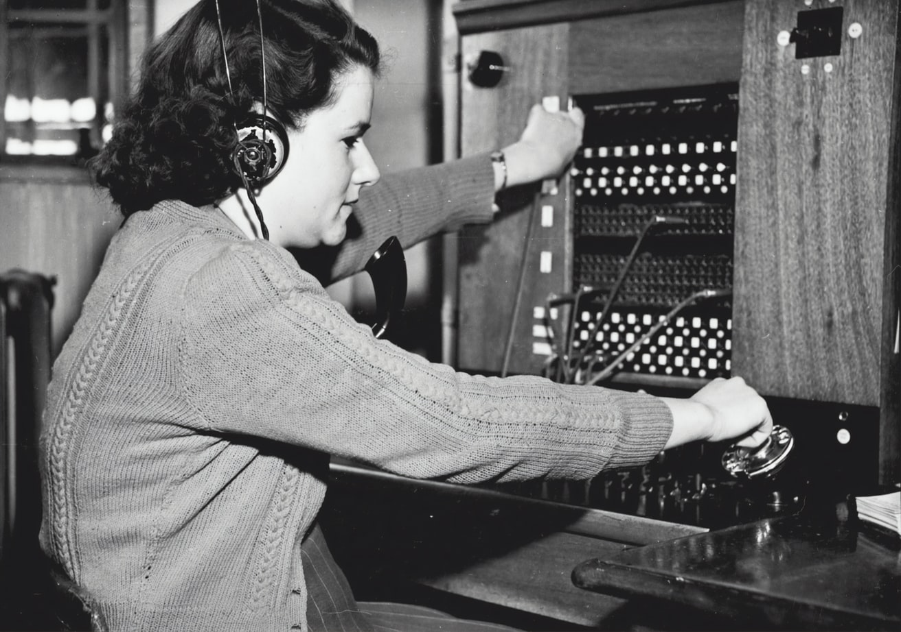

# Photo Info

## ***Werestopheles the Open Source Warrior Divinity*** by Mark Charipar 
---
Not to be used without documented authorization.

The following sprites are from the webiste unsplash.com.  The sites permissive copyright terms can be seen at the [following url](https://unsplash.com/license):

>[Background](https://unsplash.com/photos/iar-afB0QQw)

>[Werewolf Typist](https://unsplash.com/photos/wL4knvbQphI)

Addionally the sprite below is from pexels.com.  The sites licensesing info can be found at the [following url](https://www.pexels.com/license/).

>[Floating Laptop](https://www.pexels.com/photo/person-touching-open-macbook-on-table-839465/)

The sprites were modified using the open-source GIMP (GNU Image Manipulation Program).  Included is a url to a FAQ containing [GIMP's usage policy](https://www.gimp.org/docs/userfaq.html).

---
## Greyscale switchboard

 
by Museums Victoria on Unsplash:
https://unsplash.com/photos/TVe0IEdsVc8