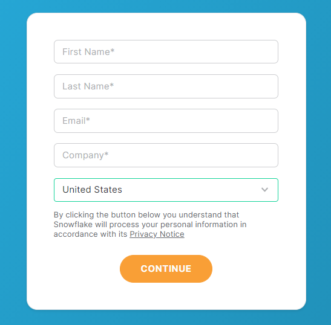
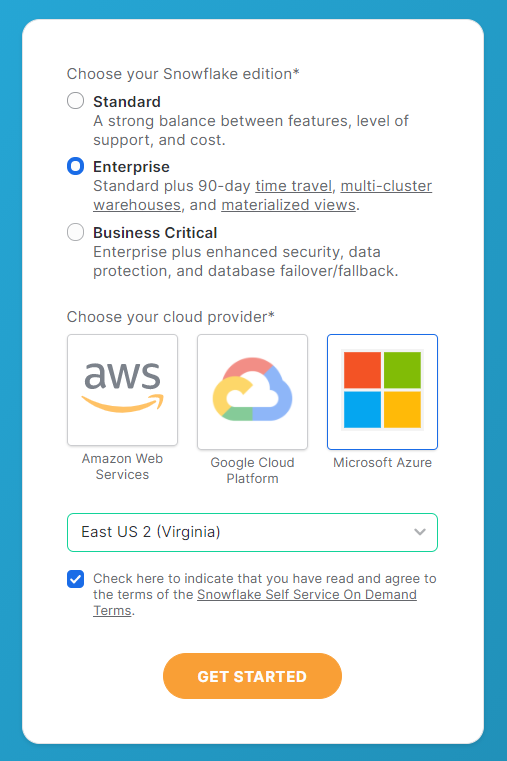
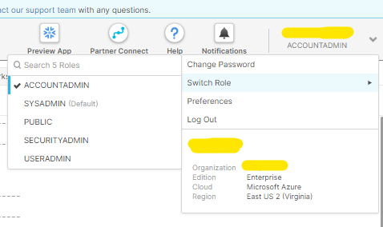
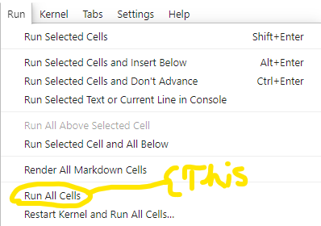

# Initial Upload

## Setup a Snowflake Account

Go to:
[https://www.snowflake.com/](https://www.snowflake.com/)

Click on "START FOR FREE" on top right corner.


Fill in required fields (can make multiple trial accounts with same email address).



Click "CONTINUE"

Select "Enterprise" (Any should work really).



Select any cloud.

Select any region.

Click "GET STARTED"

Fill in capcha.

Open email you provided in previous field.

Open email from sent from Snowflake (may take a min.), click "CLICK TO ACTIVATE".

Type in a Username and Password...be sure to make a note of this somewhere.

In the top right corner click on your Username and then clikc on "Switch Role", then click "ACCOUNTADMIN" (need this to do most things on the web app).



## Follow Login Credentials Instructions

[Follow this guide.](../Login_Credentials/README.md)

## Follow Setup Folder Instructions

[Follow this guide.](../Setup/README.md)

## Run the Notebook

From the cli were you have access to a python base, execute this command to switch to the conda env that was created from the [environment.yml](../Setup) file:

```
conda activate snowflake
```

Open a Jupyter Lab or Jupyter Notebook from the cli:

```
jupyter lab
```
or
```
jupyter notebook
```
Alternatively you can always open it from the Anaconda Suite.

Then simply run the notebook by clicking `Run`->`Run All`:



This will take close to half an hour.

# Creating the Dashboard

Follow [these instructions](../PBI_Dashboard/README.md).

---
Reference all of the README.md's and don't for get to you [Google](www.google.com) if you have to troubleshoot.
Some comments are provided in the notebook as well.