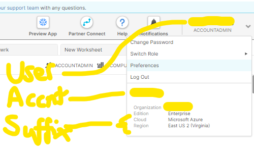
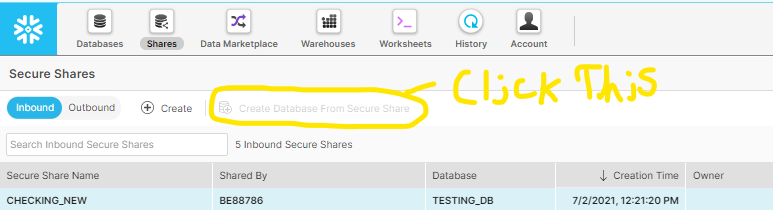

# Instructions

## Snowflake Login Credentials and Uploaded Execel Files
---
In [SF_Account_Info.txt](SF_Account_Info.txt), each line corresponds to:

1. Snowflake User Name
2. Snowflake Password
3. Snowflake Account + [cloud & region suffix](https://docs.snowflake.com/en/user-guide/admin-account-identifier.html#snowflake-region-ids)
4. Path to Excel files
5. Name of the Excel File(s) 

---
## If you want to share the database with more than one account on Snowflake.
---
In [SHARED_SF_Account_Info.txt](SHARED_SF_Account_Info.txt), each line corresponds to:

1. Snowflake Share Name (Will be created with this name)
2. Snowflake Account    
    * ***MUST BE FROM SAME CLOUD AND REGION*** 
---
### Using a Shared Snowflake Database
Just Follow this picture.

