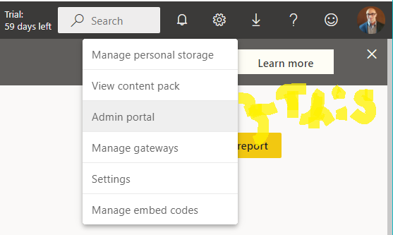

# Dashboard Instructions

>[Download Microsoft Power BI](https://www.microsoft.com/en-us/download/details.aspx?id=58494) if you don't have it installed already.

## Open [PBI_Dashboard.pbix](PBI_Dashboard.pbix)

Click on `Get Data`->`Databases`->`Snowflake` to rebuild the dashobard with your own Snowflake data that was uploaded.).

For the Server field enter in this section of your Snowflake web app URL.

## Recreating the Dashboard with Other Uploaded Snowflake Data

For each visual that is linked to the Snowflake data, ***uncheck*** the column in the `fields` menu and ***check*** the corresponding table and column name from the uploaded Snowflake data from the notebooks:

Make any additional changes that you deem appropriate.

Once the dashboard is ready to be linked to a website, click `Publish`:

Then click `Select`

Click on the blue text to go to your Power BI web portal.

Click on the `gear symbol`->`Admin Portal` 

***Note this will only work with a Power BI Pro account!** (~=10USDT:month)

Click on `Publish to web`->`Allow existing and new codes`->`Apply`

Return to the PBI Report and click `File`->`Embed Report`->`Publish to Web (Public)`

Copy the URL with the `IFRAME` html tag and place it onto the website you want to put it on.

# Updates

## Once the [Upload_Updates_Forecasts.ipynb](..Regular_Update_Upload/Upload_Updates_Forecasts.ipynb) has run, reopn the [PBI_Dashboard.pbix](../PBI_Dashboard/PBI_Dashboard.pbix) and click on `Refresh` then on `Publish` once again.  Respond affirmative to all prompts.  The dashboard will then be updated.
