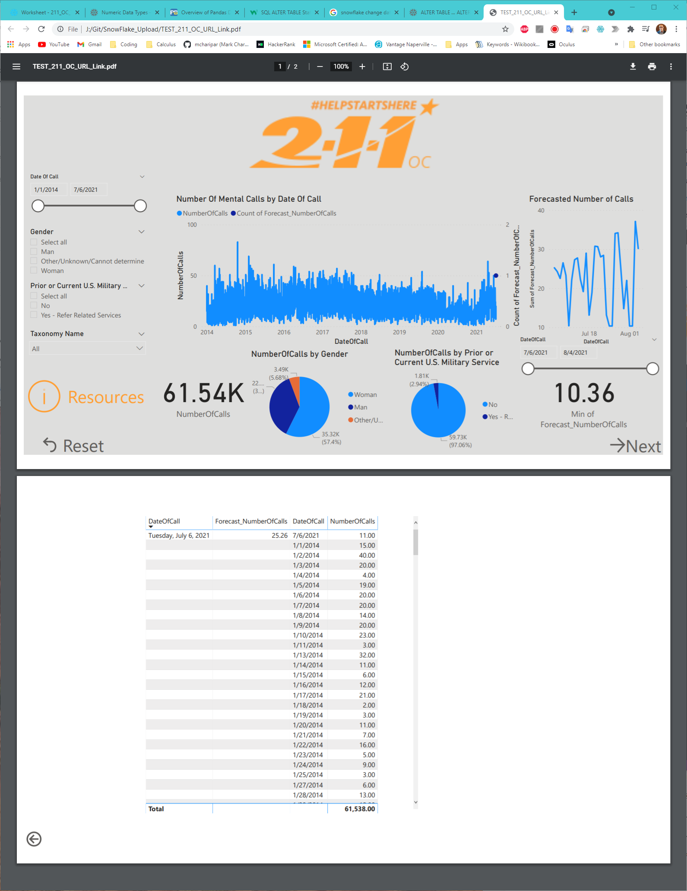

# Call Center Dashboard Forecasting Number of Calls Related to Mental Health

Check Updated_ForecastNoOfCalls(LSTM).ipynb for the forecasted calls.
- You need to update SF_Account_Info.txt, with your snowflake credentials

This is the Power BI dashboard TEST_211_OC_URL_Link.pbix
- You need to put in your snowflake credentials in PBI

Things to do:

- [ ] Correct First Forecasted Date (is same as last dateOfCall)
- [ ] Debug PBI Dashboard
- [ ] Create Python script that updates 2021 data regularly to Snowflake
- [ ] Create Shell script/ batch file, that executes both the regular 2021 updates and the Updated_ForecastNoOfCalls(LSTM).ipynb files.
- [ ] Do statistical analysis comparing actualy number of calls to forecasted, using updated 2021 data
- [ ] ?Forecast Level 2 codes?
- [ ] Make another page in the dashboard using outside data to promote further awareness to mental health

