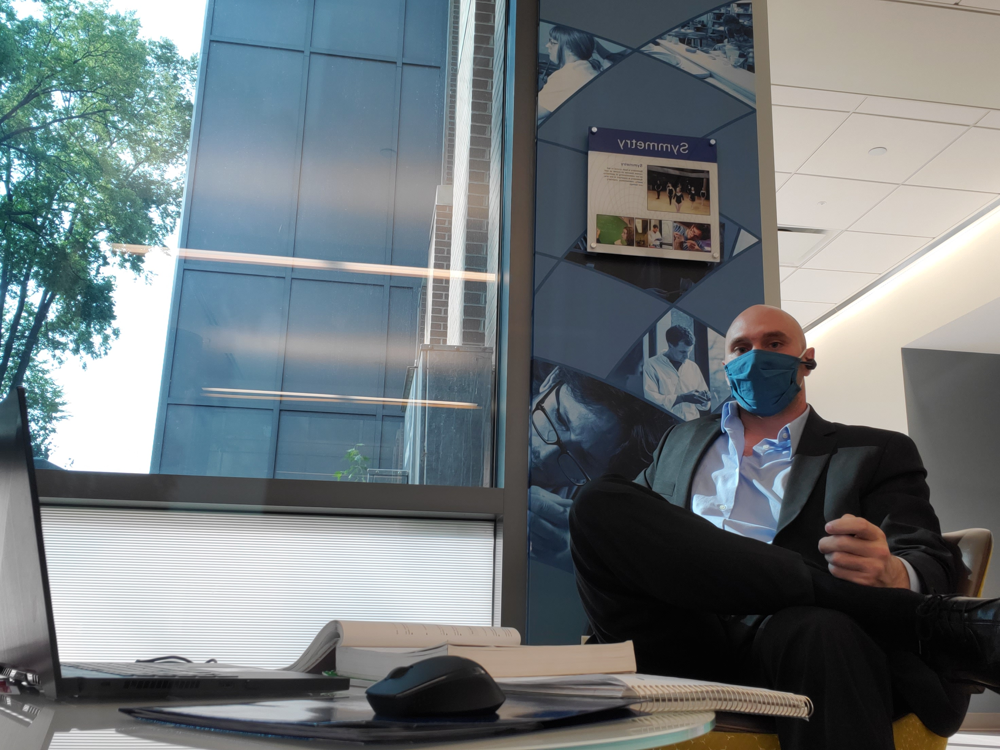

# Call Center Dashboard Forecasting Number of Calls Related to Mental Health

## Quick Start

1. Follow [these instructions](Initial_Upload_and_Dashboard/README.md)
2. **WATCH THIS SHORT VIDEO** <TO BE DONE TODAY>
    
### Updates
    
- Follow [these instructions](Regular_Update_Upload/README.md)

    
Possiible Extras
- [ ] Do statistical analysis comparing actual number of calls to forecasted, using updated 2021 data
- [ ] ?Forecast Level 2 codes?
- [ ] Make another page in the dashboard using outside data to promote further awareness to mental health

## About the Repo Owner:
Mark Charipar is a self-described philosopher in the literal greek definition (`lover of wisdom`).
Mark's strengths include (but are not limited to):
- Leadership
- Troubleshooting & Solving Technical Problems
- Using Computer & Other Science Disciplines to Find Practical Solutions

